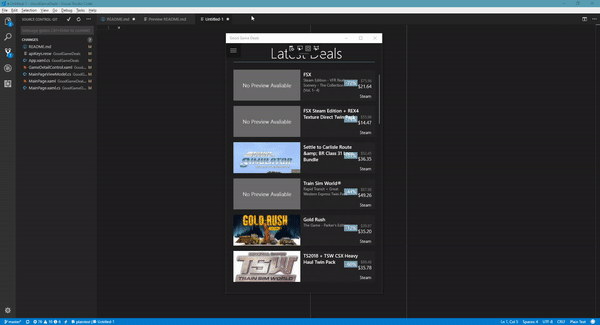

# Good Game Deals

`Good Game Deals` is a Universal Windows Platform application for finding the best deals on the market for video games. The application is still in heavy development and can only display the latest deals at the moment. Additionality functionality to view the details of each game and adapting the application to different resolutions will be added soon.

## Getting Started

The project is still in development and has not been released to the Windows Store yet. To run the application you must build from source.

### Prerequisites

You will need to clone this repository onto your computer using [git](https://git-scm.com/downloads), have [Visual Studio 2017](https://www.visualstudio.com/downloads/) installed. You will also need accounts on [Is There Any Deal](https://isthereanydeal.com/apps/) and [IGDB](https://www.igdb.com/api) to access their api. 

### Installing

1. Clone the repository onto your computer
```
git clone https://github.com/drdgvhbh/GoodGameDeals.git
```

2. Search for the `For Developer Settings` on your computer and change the `Use Developer Features` mode to `Developer Mode`.

3. Create a new app from the `Is There Any deal` [page](https://isthereanydeal.com/dev/app/).


4. Request an api key.


5. Request a key from the `IGDB` api [page](https://api.igdb.com/).
.

6. Store these keys in your `apiKeys.resw` file.

7. Restore Nuget packages in your Visual Studio solution and make sure the `GoodGameDeals` project is in deploy mode.


### Running the App
Build the solution and run it in debug mode.
Currently there is a bottleneck in the load times on the first load but subsequent loads are significantly faster because the API data is cached.

It should now look like this.




## Built With

* [Template10](https://github.com/Windows-XAML/Template10) - The template used
* [Unity Container](https://github.com/unitycontainer/unity) - Dependency Injection Framework
* [Rx](https://www.nuget.org/packages/System.Reactive/) - Reactive Extensions for C#
* [UWP Community Toolkit](https://github.com/Microsoft/UWPCommunityToolkit) - Provides additional functionalities to the UWP platform

## License

This project is licensed under the MIT License - see the [LICENSE.md](LICENSE.md) file for details

## Acknowledgments

* [Is There Any Deal Api](https://itad.docs.apiary.io/)
* [IGDB Api](https://www.igdb.com/api)
